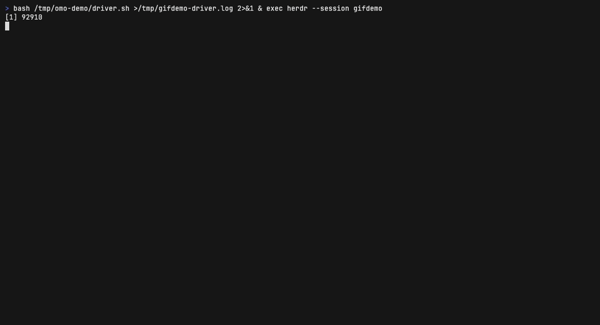
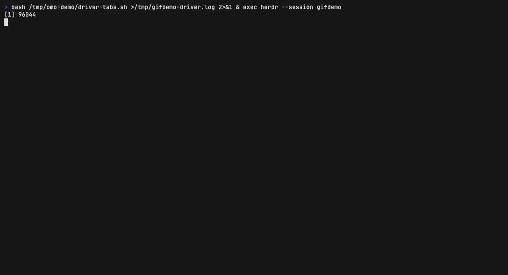

# herdr-oh-my-agent

**See every oh-my-openagent subagent working live, each in its own [Herdr](https://herdr.dev) pane or tab — with full session state and scrollback.**

[](https://github.com/GavinTomlins/herdr-oh-my-agent/releases)
[](LICENSE)
[](https://herdr.dev/docs/install/)
[](https://opencode.ai)
[](#requirements)



[oh-my-openagent](https://github.com/code-yeongyu/oh-my-openagent) (a.k.a. *oh-my-agent* / *omo*) turns [OpenCode](https://opencode.ai) into an orchestrated team: a coordinator agent (sisyphus, atlas, …) delegates work to specialist subagents (oracle, momus, explore, librarian, sisyphus-junior, …). Normally those delegations are invisible — you watch a single pane that just says "working", or you walk the session tree by hand (`Ctrl+X` + arrows) after the fact.

This plugin makes the whole team visible. The moment a delegation starts, the subagent's session appears in its own Herdr pane or tab, streaming live. When it finishes, the pane stays (configurable) with the complete transcript.

> **What it is, precisely:** an OpenCode plugin, purpose-built for oh-my-openagent's delegation pattern, packaged and distributed as a Herdr plugin. The runtime logic loads inside OpenCode (that's where delegation events live); Herdr provides the panes, tabs, and agent sidebar it drives — and the `herdr plugin install` distribution channel.

## Why you'd want it

- **Live visibility** — every delegation pops its own pane the second it starts; the Herdr Agents sidebar tracks each one (working → done) without you polling.
- **Full scrollback, forever** — each pane attaches to the *real* child OpenCode session. Sessions persist on disk; scroll the entire transcript during or long after the run, or re-attach days later.
- **Zero interference** — pure observation. Delegation semantics, model routing, and safety behavior are untouched; nothing executes twice; a failed Herdr call can never break a delegation.
- **Panes or tabs, your call** — split beside the orchestrator or one tab per subagent, chosen by one env var.

## How it works

Every omo delegation creates a **real child OpenCode session** on the OpenCode server. This plugin (an OpenCode plugin) listens for those sessions being created and, for each one:

1. Creates a Herdr split or tab next to your orchestrator (never stealing focus).
2. Runs `opencode attach --session <child-session-id>` in it — the pane shows the *actual* subagent session, live.
3. Reports the agent's name, task, and session id to Herdr, so the Agents sidebar tracks it and Herdr's session restore can revive the pane later.

```
┌─ orchestrator ─────────┐┌─ oracle ────────────────┐
│ sisyphus: delegating   ││ reviewing index.ts ...  │
│ ARCH-014 review to     ││ > read file             │
│ oracle + explore ...   ││ > the event handling is │
│                        ││   sound because ...     │
│                        │└─────────────────────────┘
│                        │┌─ explore ───────────────┐
│                        ││ mapping repo layout ... │
└────────────────────────┘└─────────────────────────┘
```

## Requirements

| Requirement | Why |
|---|---|
| [Herdr](https://herdr.dev/docs/install/) ≥ 0.7.5 | The terminal multiplexer hosting the panes |
| [OpenCode](https://opencode.ai) ≥ 1.18 | Provides `opencode attach --session` |
| [oh-my-openagent](https://omo.dev/docs) ≥ 4.19 | The orchestration layer whose delegations are mirrored |
| [Bun](https://bun.sh) | Runs the OpenCode plugin |

## Quick start

1. **Install** via the Herdr plugin system (review the preview, confirm):

   ```bash
   herdr plugin install GavinTomlins/herdr-oh-my-agent
   ```

2. **Register** the OpenCode plugin into your `opencode.json` (idempotent; a timestamped backup is taken first — `…unregister` reverses it):

   ```bash
   herdr plugin action invoke gavintomlins.herdr-oh-my-agent.register
   ```

3. **Launch** OpenCode inside a Herdr pane, with a fixed port:

   ```bash
   opencode --port 4096
   ```

   Prefer tabs over splits? `HERDR_SUBAGENT_PLACEMENT=tab opencode --port 4096`

4. **Delegate.** Any prompt that makes the orchestrator delegate pops a live pane per subagent. Try:

   > Delegate to the oracle subagent: review packages/herdr-subagent-panes/index.ts and assess whether the event handling is sound.

   Or fan out several at once by prefixing a real task with omo's `ulw` keyword:

   > ulw Review this repository and identify gaps before the next release.

<details>
<summary>Manual install (without the Herdr plugin system)</summary>

```bash
git clone https://github.com/GavinTomlins/herdr-oh-my-agent
cd herdr-oh-my-agent
bun install --cwd packages/herdr-subagent-panes
bun scripts/register-opencode-plugin.mjs
```

Or add the absolute path of `packages/herdr-subagent-panes` to the `plugin` array of your `opencode.json` yourself, then restart opencode.

</details>

## Configuration

Set env vars where you launch `opencode`:

| Variable | Default | Meaning |
|---|---|---|
| `HERDR_SUBAGENT_PANES` | `1` | `0` disables the plugin entirely |
| `HERDR_SUBAGENT_PLACEMENT` | `split` | `split` = pane beside the orchestrator; `tab` = new tab per subagent |
| `HERDR_SUBAGENT_RATIO` | `0.4` | Split ratio (split placement only) |
| `HERDR_SUBAGENT_LIFECYCLE` | `keep` | `keep` leaves panes open for review; `close_on_done` closes them when the subagent finishes |
| `HERDR_SUBAGENT_MAX_PANES` | `8` | Cap on mirror panes, guarding against delegation storms |

`HERDR_SUBAGENT_PLACEMENT=tab` gives every subagent its own labeled tab instead of a split — the tab bar becomes your delegation timeline:



## Limitations

- **A fixed port is required.** `opencode --port 4096` (any port) — attach URLs can't be built from a random port.
- **Panes are per-session, not per-agent.** Three oracle delegations = three panes, each with its own complete transcript. Busy orchestrations may prefer `close_on_done` or a higher cap.
- **Scrollback lives inside the attach pane.** Scroll there for the full replayed transcript; Herdr's own `pane read` sees only the visible viewport of full-screen apps.
- **Trivial prompts don't delegate.** "What is today?" is answered inline by the orchestrator — no subagent, no pane. Correct behavior, not a failure.
- **Keep omo's tmux mirroring off** (`tmux.enabled: false`, the default). This plugin is its Herdr equivalent; running both fights over the same sessions.
- Outside Herdr (no `HERDR_PANE_ID`) the plugin no-ops completely.

## Troubleshooting

The plugin logs every decision to `~/.local/share/herdr-subagent-panes/plugin.log`:

```bash
tail -f ~/.local/share/herdr-subagent-panes/plugin.log
```

| Symptom | Meaning / fix |
|---|---|
| No log file after starting opencode | Plugin not loaded — check the `plugin` array in `opencode.json`, restart opencode (plugins load at startup only) |
| `loaded but disabled: HERDR_PANE_ID not set` | opencode isn't running inside a Herdr-managed pane |
| `active: …` but no pane on delegation | Check the log for `herdr exit …` lines — they include herdr's stderr. Verify `herdr` is on PATH in that pane |
| opencode hangs at launch with no output | The port is already taken by an earlier instance — `lsof -nP -iTCP:4096 -sTCP:LISTEN`, then quit or `kill` it |
| `session.created … parentID=none` only | Your prompt didn't cause a delegation — see the example prompts above |
| Pane appears then instantly closes | The attach raced session creation; the plugin waits for readiness, but if it recurs please open an issue |

## The ecosystem

- **Herdr** — mouse-first terminal multiplexer with native coding-agent awareness. [Docs](https://herdr.dev/docs/) · [GitHub](https://github.com/herdrdev/herdr) · [Agents guide](https://herdr.dev/docs/agents/) · [Plugin system](https://herdr.dev/docs/plugins/)
- **oh-my-openagent (oh-my-agent / omo)** — multi-agent orchestration for OpenCode: planning, delegation with evidence requirements, model routing per task category. [Docs](https://omo.dev/docs) · [GitHub](https://github.com/code-yeongyu/oh-my-openagent)
- **OpenCode** — the agent platform both build on; its sessions, server API, and `attach` command make this plugin possible. [Site](https://opencode.ai)

## Roadmap

- **Sidebar tree view** — a Herdr-side companion rendering orchestrator → subagent nesting in the Agents sidebar via metadata tokens and `agent.view.set` projections.
- **Stream mode** — an alternative read-only plaintext transcript pane (line-oriented, so Herdr-native scrollback and `pane read` work on it).
- **Per-agent tab reuse** — optionally re-attach one long-lived tab per agent name instead of one tab per session.

## Repository layout

```
herdr-plugin.toml                    Herdr plugin manifest (build + register/unregister actions)
packages/herdr-subagent-panes/       The OpenCode plugin (Bun + TypeScript)
scripts/register-opencode-plugin.mjs Adds/removes the plugin in opencode.json safely
AGENTS.md                            Instructions for coding agents installing or operating this plugin
PLAN.md                              Design notes and roadmap detail
```

## License

[MIT](LICENSE) © Gavin Tomlins
